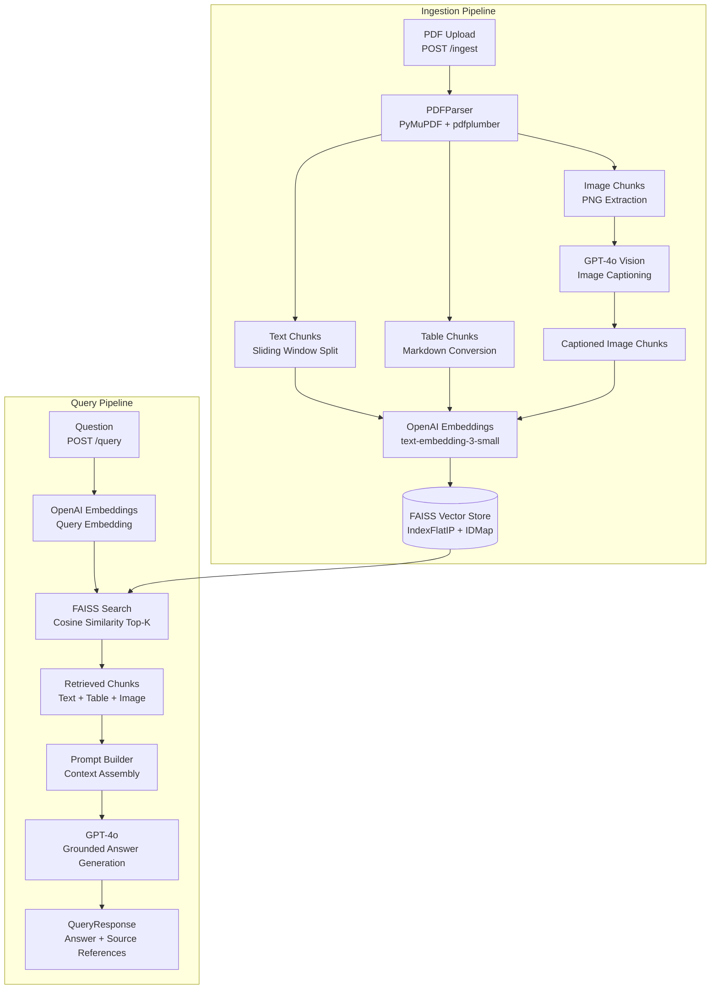

# Multimodal RAG System for Financial Research & Investment Analysis

> **BITS Pilani WILP — Multimodal RAG Bootcamp | Take-Home Assignment**

---

## Problem Statement

### Domain Identification

This system is built for the **financial research and investment analysis** domain — specifically targeting equity research analysts, portfolio managers, and quantitative researchers who consume large volumes of multimodal documents daily: annual reports, earnings call transcripts, investor presentations, sell-side research PDFs, regulatory filings (10-K, 10-Q), and fund factsheets.

### Problem Description

Financial professionals must extract actionable insights from documents that combine dense prose, complex data tables, and rich visualisations (charts, heatmaps, candlestick graphs, geographic distribution maps). A typical equity research report is 40–80 pages and contains:

- **Paragraphs** with qualitative analysis (management commentary, competitive positioning, risk factors)
- **Tables** with financial data (income statements, segment breakdowns, peer comparison matrices)
- **Charts and figures** (revenue trend lines, margin waterfall charts, valuation multiples scatter plots)

Currently, analysts use keyword search (CTRL+F), manual skimming, or expensive third-party tools that index only the text layer of PDFs and discard tables and images entirely. This means that a question like *"What was the EBITDA margin trend shown in the waterfall chart on page 14?"* cannot be answered by any traditional system — the analyst must locate and read the document manually.

### Why This Problem Is Unique

Financial documents present domain-specific RAG challenges that generic document Q&A systems are not designed for:

1. **Structured financial tables**: Peer comparison tables and segment financials use merged cells, multi-level headers, and footnotes. Standard text extractors mangle these into unreadable strings. Accurate table parsing is critical — a misread revenue figure can lead to incorrect investment decisions.

2. **Chart-heavy visualisations**: Sell-side research relies heavily on annotated charts (earnings revisions, relative performance, scenario analysis). These figures convey quantitative information that exists nowhere in the text layer of the PDF. Without vision-language model captioning, this information is completely invisible to any retrieval system.

3. **Specialised terminology**: Financial documents use precise domain vocabulary (CAGR, LTM EBITDA, EV/EBITDA, FCF yield, NIM, CET1 ratio) that generic embedding models may not represent well. Understanding that "12x forward multiple" and "price-to-earnings of 12" are semantically equivalent requires domain-aware retrieval.

4. **Cross-modal reasoning**: The most analytically valuable insights often require connecting text, table, and image content simultaneously — e.g., a management commentary (text) should be reconciled with the reported numbers (table) and the trend chart (image). A single-modality system misses this entirely.

### Why RAG Is the Right Approach

Fine-tuning an LLM on financial documents would require continuous retraining as new reports are published — an operationally impractical and expensive approach. Keyword search cannot handle semantic questions ("what factors drove margin compression?"). Manual search scales poorly as document volumes grow.

RAG is the right architecture because:
- **Freshness**: New research reports can be ingested in seconds without any model retraining
- **Grounding**: Every answer is traced back to a specific chunk, page, and document — auditability is critical in regulated industries
- **Multimodal coverage**: By captioning images before embedding, we make chart content semantically searchable for the first time
- **Cost-efficiency**: Embedding and retrieval costs are a fraction of running every query through a full document with a long-context LLM

### Expected Outcomes

A successful system enables financial analysts to:
- Ask natural language questions about any ingested research report and receive cited, grounded answers in seconds
- Retrieve relevant table rows ("What were the Q3 2023 gross margins by segment?")
- Retrieve chart interpretations ("What does the revenue growth trajectory chart show for emerging markets?")
- Compare data across multiple ingested documents ("How does Company A's leverage ratio compare to Company B?")
- Reduce manual PDF review time from 2–3 hours per report to under 10 minutes

---

## Architecture Overview



---

## Technology Choices

| Component | Choice | Justification |
|-----------|--------|---------------|
| **Document Parser** | PyMuPDF (fitz) + pdfplumber | PyMuPDF provides the fastest, most accurate text and image extraction from PDFs. pdfplumber is specifically optimised for financial table detection with multi-column layouts — it outperforms fitz's built-in table extractor on financial documents with merged cells. |
| **Embedding Model** | `text-embedding-3-small` (OpenAI) | Delivers 1536-dimensional embeddings with strong financial domain performance. Chosen over `text-embedding-3-large` for its 5× lower cost at comparable retrieval quality for domain-specific Q&A. Avoids the complexity of self-hosting HuggingFace models. |
| **Vector Store** | FAISS (IndexFlatIP + IDMap) | FAISS requires zero infrastructure — no external server, no managed service fees. For a single-user research workbench handling hundreds of documents, FAISS's in-memory index delivers sub-millisecond retrieval. ChromaDB would be preferable if metadata filtering (by sector, date, ticker) were added in future. |
| **LLM** | GPT-4o | Best-in-class reasoning on financial text with strong instruction-following for grounded, cited answers. Chosen over Claude or Gemini to maintain a single-provider (OpenAI-only) dependency as specified by the assignment. |
| **Vision Model** | GPT-4o (same model) | GPT-4o's vision capability accurately interprets financial charts, bar graphs, and data tables rendered as images. Using the same model for both vision and text simplifies the API client and reduces latency vs calling a separate VLM endpoint. |
| **Framework** | FastAPI (raw, no LangChain) | Direct OpenAI SDK calls give full control over prompt construction, retry logic, and error handling without abstraction-layer overhead. LangChain would add complexity without benefit for this scope. |

---

## Setup Instructions

### Prerequisites

- Python 3.10+
- An OpenAI API key with access to `gpt-4o` and `text-embedding-3-small`

### 1. Clone the repository

```bash
git clone https://github.com/your-username/multimodal-rag-financial.git
cd multimodal-rag-financial
```

### 2. Create a virtual environment

```bash
python -m venv venv
source venv/bin/activate        # macOS/Linux
# venv\Scripts\activate         # Windows
```

### 3. Install dependencies

```bash
pip install -r requirements.txt
```

### 4. Configure environment variables

```bash
cp .env.example .env
# Edit .env and add your OpenAI API key:
# OPENAI_API_KEY=sk-...
```

### 5. Create the data directory

```bash
mkdir -p data
# Place your PDF in the data/ folder, or upload via POST /ingest
```

### 6. Start the server

```bash
python main.py
# Server starts at http://localhost:8000
# Swagger UI: http://localhost:8000/docs
```

### 7. Ingest a document

```bash
curl -X POST http://localhost:8000/ingest \
  -F "file=@data/your_report.pdf"
```

### 8. Query the system

```bash
curl -X POST http://localhost:8000/query \
  -H "Content-Type: application/json" \
  -d '{"question": "What was the revenue growth rate in the latest fiscal year?"}'
```

---

## API Documentation

### `GET /health`

Returns system status.

**Response:**
```json
{
  "status": "ok",
  "model": "gpt-4o",
  "embedding_model": "text-embedding-3-small",
  "indexed_documents": 3,
  "total_chunks": 142,
  "uptime_seconds": 320.4
}
```

---

### `POST /ingest`

Upload a PDF to be parsed, captioned, embedded, and indexed.

**Request:** `multipart/form-data` with a `file` field (PDF only)

**Response:**
```json
{
  "filename": "annual_report_2023.pdf",
  "text_chunks": 48,
  "table_chunks": 12,
  "image_chunks": 7,
  "total_chunks": 67,
  "processing_time_seconds": 24.3
}
```

**Error responses:**
- `400` — File is not a PDF
- `500` — Parsing or embedding failure

---

### `POST /query`

Ask a natural language question against all indexed documents.

**Request:**
```json
{
  "question": "What does the margin waterfall chart show for Q3?",
  "top_k": 5
}
```

**Response:**
```json
{
  "question": "What does the margin waterfall chart show for Q3?",
  "answer": "The margin waterfall chart on page 18 of 'Q3_Research_Report.pdf' shows that gross margin declined by 2.3 percentage points in Q3 2023, driven primarily by higher raw material costs (+1.8pp) and logistics inflation (+0.5pp), partially offset by pricing actions (+0.8pp)...",
  "sources": [
    {
      "chunk_id": "Q3_Research_Report.pdf_p18_a4f2c1d8",
      "source_file": "Q3_Research_Report.pdf",
      "page_number": 18,
      "chunk_type": "image",
      "content_preview": "[Figure on page 18] A margin waterfall chart showing..."
    }
  ],
  "chunks_retrieved": 5,
  "model_used": "gpt-4o"
}
```

---

### `GET /documents`

List all indexed document filenames.

**Response:**
```json
{
  "documents": ["annual_report_2023.pdf", "Q3_earnings.pdf"],
  "total_documents": 2
}
```

---

### `DELETE /documents/{filename}`

Remove a document and its chunks from the vector index.

**Response:**
```json
{
  "message": "Successfully removed annual_report_2023.pdf from the index.",
  "filename": "annual_report_2023.pdf",
  "chunks_removed": 67
}
```

---

### `GET /docs`

FastAPI auto-generated Swagger/OpenAPI UI — interactive documentation for all endpoints.

---

## Screenshots

> Place your screenshots in the `screenshots/` folder and link them below after running the system.

| Screenshot | Description |
|------------|-------------|
| `screenshots/01_swagger_ui.png` | `/docs` page showing all endpoints |
| `screenshots/02_ingest_response.png` | POST /ingest with a multimodal PDF |
| `screenshots/03_text_query.png` | Text-based chunk retrieval |
| `screenshots/04_table_query.png` | Table-based chunk retrieval |
| `screenshots/05_image_query.png` | Image/figure chunk retrieval |
| `screenshots/06_health_endpoint.png` | /health showing indexed doc count |

---

## Limitations & Future Work

### Current Limitations

1. **Deletion does not purge vectors**: The FAISS `IndexFlatIP` does not support in-place vector removal. When a document is deleted, its metadata is removed but the original vectors remain in the FAISS index until the server restarts and the index is rebuilt. A production system would use a vector store with native delete support (Weaviate, Pinecone, Qdrant).

2. **No authentication**: The API has no authentication layer. Any client with network access can ingest, query, or delete documents. For a production deployment, OAuth2 or API key middleware should be added.

3. **Single-node, in-memory index**: FAISS runs in-process and does not support horizontal scaling. For large document corpora (10,000+ pages), a distributed vector store (Milvus, Pinecone) would be required.

4. **Image captioning latency**: Captioning each extracted image with GPT-4o adds 2–5 seconds per image. A 60-page PDF with 10 figures may take 60–90 seconds to ingest. Async parallel captioning would reduce this significantly.

5. **Table extraction accuracy**: pdfplumber performs well on well-structured PDFs but may misparse tables with complex merged cells, rotated text, or scanned layouts. Integrating a dedicated table extraction service (Amazon Textract, Microsoft Document Intelligence) would improve accuracy.

### Future Work

- **Metadata filtering**: Add FAISS metadata-aware retrieval or migrate to ChromaDB to support filtering by `source_file`, `chunk_type`, `page_number`, or custom tags (sector, ticker, date).
- **Re-ranking**: Add a cross-encoder re-ranker (e.g., `cross-encoder/ms-marco-MiniLM`) as a second retrieval stage to improve precision.
- **Streaming responses**: Stream the GPT-4o answer via Server-Sent Events for faster perceived response time.
- **Multi-tenant support**: Namespace the vector index per user or organisation.
- **Evaluation harness**: Add an automated RAG evaluation suite (RAGAS or custom) with ground-truth QA pairs from the financial domain.
